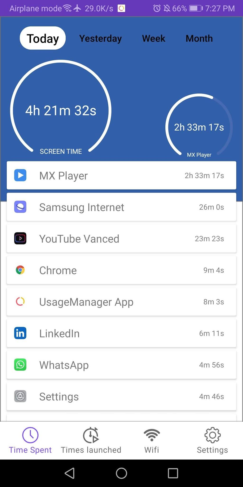
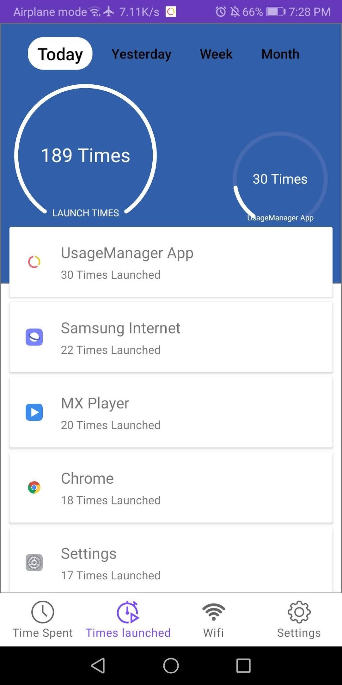
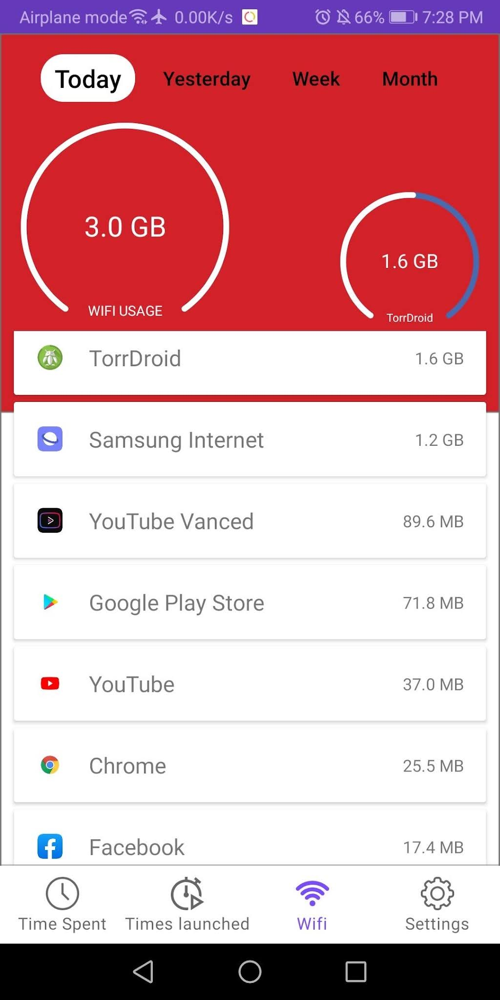
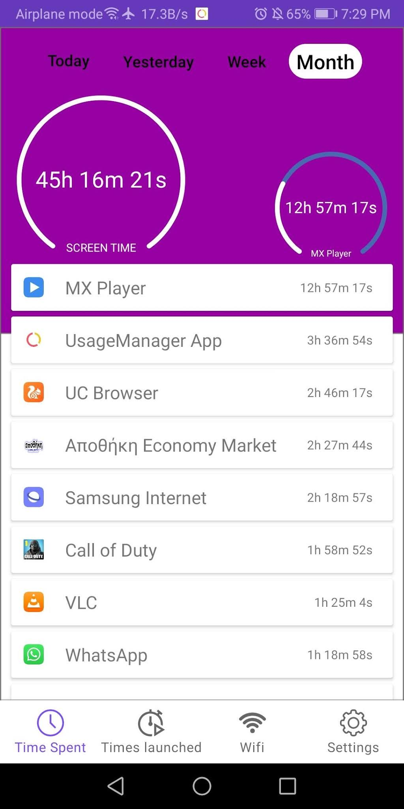
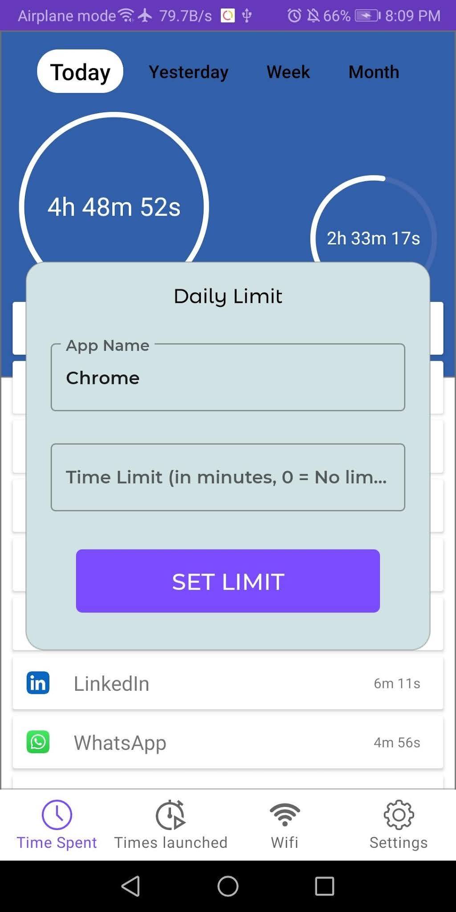
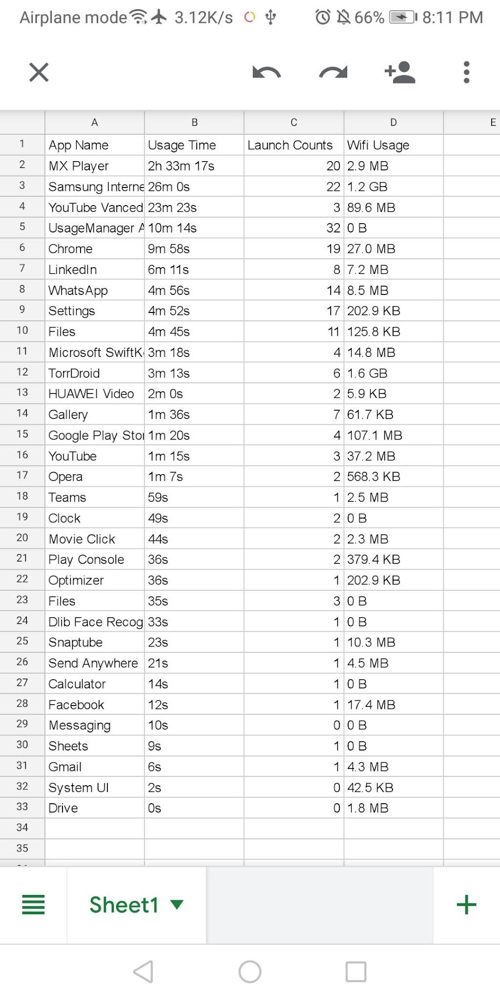

# UsageManagerApp

> Android usage analytics for understanding screen time, app launches, network activity, and digital habits.

**Java · Android SDK · Usage Statistics · Background Services · CSV Export**

Designed and developed by **Farnaz Zinnah**.

---

## 30-Second Read

| | |
|---|---|
| **Platform** | Android |
| **Language** | Java |
| **Purpose** | Monitor and understand application usage |
| **Analytics** | Screen time, launch counts, Wi-Fi usage |
| **Time ranges** | Daily, weekly, and monthly |
| **Controls** | Per-app usage limits and notifications |
| **Export** | Usage data to CSV |
| **Minimum SDK** | Android 5.0 / API 21 |

UsageManagerApp provides a visual interface for understanding how applications are used on an Android device.

The application combines Android usage statistics with app-level analytics so users can inspect time spent, launch frequency, network usage, and longer-term usage patterns.

---

## Application Preview

### Time Spent

Tracks how much time is spent inside installed applications.

### App Launches

Displays how many times applications have been launched.

### Wi-Fi Usage

Shows application-level Wi-Fi usage.

### Daily, Weekly, and Monthly Analytics

Provides multiple time ranges for understanding usage patterns.

### Usage Limits

Allows users to configure per-application usage limits and receive notifications when limits are exceeded.

### CSV Export

Exports collected usage information for further analysis.

---

## System Flow

    Android device usage
            |
            v
    Usage statistics
            |
      +-----+-----+
      |           |
      v           v
    Screen     Launch
     time      frequency
      |           |
      +-----+-----+
            |
            v
      Application UI
            |
      +-----+-----+
      |     |     |
      v     v     v
    Views  Limits CSV export
      |
      v
    Daily / Weekly / Monthly

---

## Core Features

### Usage Time Analytics

The application reads Android usage information and presents time spent across installed applications.

### Launch Frequency

UsageManagerApp tracks how frequently applications are opened and presents launch counts through a dedicated view.

### Network Usage

The application includes a Wi-Fi usage view for examining application-level network consumption.

### Usage Limits

Users can configure usage limits for individual applications. A background service supports usage monitoring and notifications when configured thresholds are exceeded.

### CSV Export

Usage information can be exported as CSV for additional analysis outside the application.

---

## Application Architecture

    MainActivity
        |
        +-- TimeFragment
        |      |
        |      +-- TimeAdapter
        |
        +-- LaunchedFragment
        |      |
        |      +-- LaunchedAdapter
        |
        +-- WifiFragment
        |      |
        |      +-- WifiAdapter
        |
        +-- SettingsFragment
        |
        +-- TimeUsageService

---

## Repository Structure

    UsageManagerApp/
    ├── app/
    │   ├── src/main/java/
    │   ├── src/main/res/
    │   └── build.gradle
    │
    ├── appusagemonitor/
    │   ├── src/
    │   ├── build.gradle
    │   └── UPSTREAM.md
    │
    ├── gradle/
    ├── build.gradle
    ├── settings.gradle
    ├── gradlew
    └── README.md

---

## Technology

| Area | Technology |
|---|---|
| Platform | Android |
| Language | Java |
| Minimum SDK | API 21 |
| Target SDK | API 30 |
| Build system | Gradle |
| UI | Android XML layouts |
| Background processing | Android Service |
| Image loading | Glide |
| Serialization | Gson |
| Local utility storage | TinyDB |
| Export | CSV |

---

## Third-Party Usage Monitoring Library

The original application depended on `the.bot.box:appusagemonitor:2.1.0`.

The historical hosted artifact is no longer reliably retrievable through its original package repository. To keep the project reproducible, the open-source `appusagemonitor` source module is maintained locally under `appusagemonitor/`.

Upstream project: **TheBotBox / AppsUsageMonitorAPI**

The vendored library remains third-party code and is documented separately in `appusagemonitor/UPSTREAM.md`.

---

## Build

This project uses the historical Android toolchain that matches the application.

Requirements:

    JDK 11
    Android SDK
    Android API 30

Build the debug APK:

    export JAVA_HOME=$(/usr/libexec/java_home -v 11)
    export ANDROID_SDK_ROOT="$HOME/Library/Android/sdk"
    ./gradlew assembleDebug

Successful build output:

    app/build/outputs/apk/debug/app-debug.apk

---

## Project Evolution

UsageManagerApp began inside a larger Java coursework repository containing several unrelated exercises.

For the maintained portfolio edition, the repository was reorganized so the Android application is the sole focus:

- moved the Android project to the repository root
- removed unrelated Java coursework
- preserved the original six application screenshots
- restored the historical Gradle toolchain using JDK 11
- replaced an unavailable hosted dependency with its documented open-source source module
- verified compilation through `assembleDebug`

The application remains representative of the original Android implementation rather than being rewritten into a newer framework.

---

## Status

    STATUS       maintained portfolio project
    PLATFORM     Android
    LANGUAGE     Java
    MIN SDK      API 21
    TARGET SDK   API 30
    BUILD        verified
    OUTPUT       debug APK
